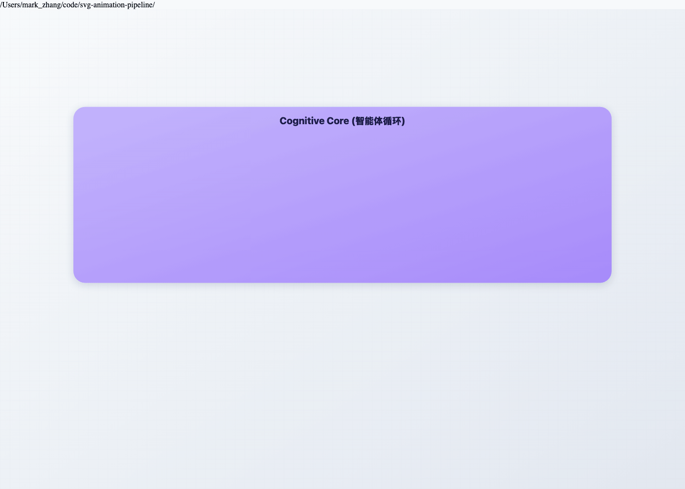

# SVG Animation Pipeline

端到端 SVG 动画流水线：**SVG 分层 → 程序化动画 → 按帧渲染 → FFmpeg 合成**

## Features

- **SVG 分层解析**：加载 SVG 文件，提取图层结构，校验兼容性
- **程序化动画**：关键帧引擎，支持 24 种缓动函数，变换/颜色/路径插值
- **按帧渲染**：Puppeteer 无头浏览器逐帧渲染，DOM 元素缓存优化
- **FFmpeg 合成**：输出 GIF（调色板优化）、MP4 或 WebM

## Installation

```bash
npm install
```

## Prerequisites

- Node.js 18+
- FFmpeg（通过 `@ffmpeg-installer/ffmpeg` 自动安装）

## Quick Start

```typescript
import { SVGAnimationPipeline } from 'svg-animation-pipeline';

const pipeline = new SVGAnimationPipeline({
  input: 'logo.svg',
  output: 'output.gif',
  fps: 30,
  duration: 2000,
  width: 800,
  height: 600,
});

pipeline.addAnimation({
  targets: '#stroke-layer',
  keyframes: [
    { time: 0, properties: { strokeDashoffset: 1000, opacity: 0 } },
    { time: 1000, properties: { strokeDashoffset: 0, opacity: 1 } },
  ],
  easing: 'easeInOutQuad',
});

pipeline.on('progress', (progress) => {
  console.log(`${progress.percent}% - ${progress.message}`);
});

await pipeline.render();
```

## API Reference

### SVGAnimationPipeline

```typescript
new SVGAnimationPipeline(config: PipelineConfig, events?: PipelineEvents)
```

#### Configuration

| Option | Type | Default | Description |
|--------|------|---------|-------------|
| `input` | `string` | required | SVG 文件路径或 SVG 内容字符串 |
| `output` | `string` | required | 输出文件路径 (.gif, .mp4, .webm) |
| `fps` | `number` | 30 | 帧率 (Frames per second) |
| `duration` | `number` | required | 动画时长 (毫秒) |
| `width` | `number` | 800 | 渲染宽度 (像素) |
| `height` | `number` | 600 | 渲染高度 (像素) |
| `background` | `string` | '#ffffff' | 背景颜色 |
| `quality` | `'low' \| 'medium' \| 'high'` | `'medium'` | 渲染质量 |

#### Methods

- `addAnimation(config: AnimationConfig)` - 添加一个动画
- `addAnimations(configs: AnimationConfig[])` - 批量添加动画
- `setStyles(css: string)` - 注入 CSS 样式
- `on(event, handler)` - 注册事件处理器
- `render()` - 执行流水线
- `getLayers()` - 获取解析后的 SVG 图层
- `getParsedSVG()` - 获取解析后的 SVG 元数据
- `close()` - 关闭浏览器资源

#### AnimationConfig

```typescript
{
  targets: string | string[],   // 目标元素的 CSS 选择器
  keyframes: Keyframe[],        // 关键帧数组
  easing?: EasingType,          // 默认缓动函数
}
```

#### Keyframe

```typescript
{
  time: number,                  // 时间 (毫秒)
  properties: AnimatableProperties,
  easing?: EasingType,           // 该段的缓动函数
}
```

### Easing Functions

| 名称 | 描述 |
|------|------|
| `linear` | 匀速 |
| `easeIn`, `easeOut`, `easeInOut` | 基础缓动 |
| `easeInQuad`, `easeOutQuad`, `easeInOutQuad` | 二次缓动 |
| `easeInCubic`, `easeOutCubic`, `easeInOutCubic` | 三次缓动 |
| `easeInQuart`, `easeOutQuart`, `easeInOutQuart` | 四次缓动 |
| `easeInQuint`, `easeOutQuint`, `easeInOutQuint` | 五次缓动 |
| `easeInSine`, `easeOutSine`, `easeInOutSine` | 正弦缓动 |
| `elastic`, `easeOutElastic` | 弹性缓动 |
| `bounce` | 弹跳缓动 |
| `spring` | 弹簧缓动 |

### Animatable Properties

- `opacity` - 元素透明度 (0-1)
- `strokeDashoffset` / `strokeDasharray` - 描边动画（绘制效果）
- `transform` - 变换 (translate, rotate, scale, skew)
- `d` - 路径形变 (需要 `{ start, end }` 格式)
- `fill` / `stroke` - 颜色 (自动插值)
- `strokeWidth`, `fillOpacity`, `strokeOpacity`

## 流水线架构

```
┌──────────────────────────────────────────────────────────────────┐
│  Phase 1: 分层 (SVG Layering)                                    │
│  ┌──────────────┐    ┌──────────────┐    ┌──────────────────┐    │
│  │  SVG Loader  │───▶│  Validator   │───▶│  Layer Parser    │    │
│  │  (文件加载)   │    │  (SVG校验)   │    │  (图层提取)       │    │
│  └──────────────┘    └──────────────┘    └──────────────────┘    │
│                                                                   │
│  Phase 2: 动画 (Procedural Animation)                             │
│  ┌──────────────┐    ┌──────────────┐    ┌──────────────────┐    │
│  │   Keyframe   │───▶│  Interpolator│───▶│  Element Cache   │    │
│  │   (关键帧)    │    │  (插值计算)   │    │  (DOM元素缓存)    │    │
│  └──────────────┘    └──────────────┘    └──────────────────┘    │
│                                                                   │
│  Phase 3: 渲染 (Per-Frame Rendering)                              │
│  ┌──────────────┐    ┌──────────────┐    ┌──────────────────┐    │
│  │  State       │───▶│  Puppeteer   │───▶│  Frame Buffer    │    │
│  │  Compute     │    │  Canvas      │    │  (PNG输出)        │    │
│  └──────────────┘    └──────────────┘    └──────────────────┘    │
│                                                                   │
│  Phase 4: 合成 (FFmpeg Encoding)                                  │
│  ┌──────────────┐    ┌──────────────┐    ┌──────────────────┐    │
│  │  Frame Seq   │───▶│   FFmpeg     │───▶│  GIF / MP4 /     │    │
│  │  (帧序列)     │    │  (编码合成)   │    │  WebM Output     │    │
│  └──────────────┘    └──────────────┘    └──────────────────┘    │
└──────────────────────────────────────────────────────────────────┘
```

## Examples

### Loop Engineering Internal Mechanism


### Run Examples

```bash
npx ts-node examples/agent-architecture.ts
npx ts-node examples/layered-scene.ts
npx ts-node examples/basic-path.ts
npx ts-node examples/morph-demo.ts
```

## License

MIT